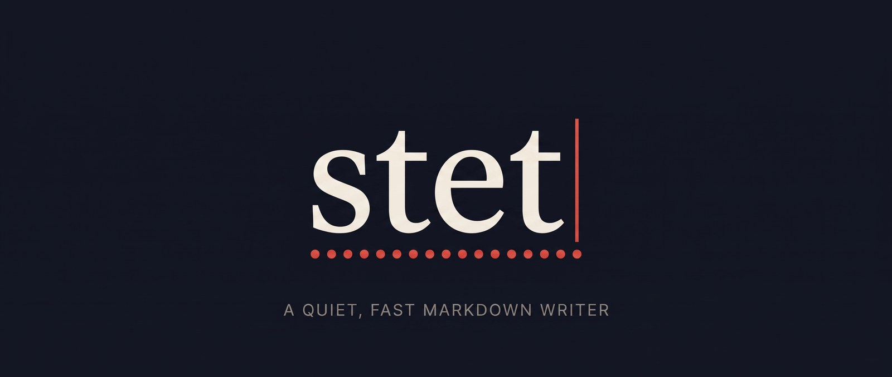

<p align="center">
  
</p>

# Stet

A quiet, fast markdown writer. Rust core, GPU-rendered, vim keys, linked
notes, review suggestions, and a way for an assistant to work in your
document without getting in your way.

*Stet* is the proofreader's mark for "let it stand" — written beside a
correction, with dots under the words, to keep the original. Suggestions you
can accept or let stand are what the review mode is built around.

## Install

```sh
curl -fsSL https://raw.githubusercontent.com/ArchAstro/stet/main/install.sh | sh
```

This downloads the latest release for macOS (Apple Silicon or Intel) or Linux
(x64), checks it against the published checksums, puts `stet` in `~/.local/bin`
and the Claude Code skill in `~/.claude/skills/stet`. `STET_INSTALL_DIR`,
`STET_VERSION=v0.1.0` and `STET_SKILL=0` change that.

On a Mac this installs `Stet.app` into `/Applications` (the `stet` command is
the same program inside it); `STET_APP=0` installs only the command. You can
also download `stet-macos.dmg` from the releases page and drag the app across.
Until releases are signed with a Developer ID, an app downloaded in a browser
needs a right-click → Open the first time; the installer does not.

While this repository is private the anonymous download does not work; with
the GitHub CLI signed in, use:

```sh
gh api repos/ArchAstro/stet/contents/install.sh -H "Accept: application/vnd.github.raw" | sh
```

On Windows, download `stet-windows-x64.zip` from the releases page. To build
from source instead (needs Rust 1.90+):

```sh
sh scripts/install.sh        # builds stet into ~/.cargo/bin, links the skill
cargo run --release -- examples/tour.md
```

## Using it

Started from a terminal, `stet file.md` opens its window as a separate process
and hands the prompt straight back. `stet --wait file.md` (or `-f`) stays attached
until the window closes, which is what `$EDITOR` and `git commit` need.

If Stet is already running, `stet other.md` opens the file there as a tab in a
few milliseconds instead of starting again (`-n` forces a separate window).

Press **Cmd-/** (Ctrl-/ elsewhere, or F1) for the menu: every command with its
shortcut, markdown syntax you can insert, and the vim keys. Type to filter.

## Layout

| Crate | Owns | Platform code |
|---|---|---|
| `crates/stet-core` | buffer + undo, vim and standard keys, markdown analysis, syntax highlighting, suggestions, links, tabs, menu and file-browser state, themes, config, file I/O, crash recovery | none |
| `crates/stet-app` | window (`winit`), renderer (`wgpu` + `glyphon`), text layout, fonts, images, clipboard, dialogs | all of it |

The core takes `KeyEvent`s, text and mouse positions, and emits `Effect`s for
what only a shell can do (display-line motion, dialogs, opening URLs, quitting).

## Keys

Vim is on by default (`:novim` or `vim = false` for a standard text field).

1. **Motions** — `h j k l w b e W B E ge 0 ^ $ gg G f F t T ; , { } ( ) % n N * #`, marks, counts.
   Bare `j`/`k` move by wrapped display line; with a count they move by logical line.
2. **Operators** — `d c y > < g~ gu gU` with motions, counts and text objects
   (`iw aw ip ap is as i" a" i( a( i[ i{ i<` …); `x X s S D C Y J gJ r ~ p P u Ctrl-r .`
3. **Insert** — `i a I A o O`, with counts (`3ix`, `2o`).
4. **Visual** — `v`, `V`, and block `Ctrl-v` (`I`, `A`, `c`, `d`, `y`, `r`, `~ u U`, `> <`); `o` swaps ends.
5. **Registers and macros** — `"a`–`"z`, `"A` append, `"0`, `"_`, `"+`; the unnamed register is the system clipboard. `qa … q` records, `@a` and `@@` replay.
6. **Search** — `/` and `?` take regular expressions (smart case, live highlight; an invalid pattern is searched literally). `:s/a/b/g` and `:%s/(\w+)@(\w+)/\2 at \1/g` support `\1`…`\9` and `&`.
7. **Command line** — `:w :q :wq :wa :qa :e :tabnew :theme :font :monofont :files :sidebar :backlinks :recover :help :<line>`; Tab completes theme and font names.
8. **Markdown** — Enter continues lists, tasks and quotes; Tab/Shift-Tab indent items; `gt` toggles a task.

Shortcuts use Cmd on macOS and Ctrl elsewhere (in vim mode on Ctrl platforms,
vim keeps its own Ctrl chords):

| Do | Key |
|---|---|
| Menu (commands, markdown, vim keys) | `/`, or F1, or click `menu` in the status line |
| Go to file | `P` |
| File browser | `\` |
| New tab, close tab | `T` or `N`, `W` |
| Next / previous tab, tab 1–9 | `Shift-]` / `Shift-[` (vim `]t` / `[t`), `1`–`9` |
| Follow link, back, forward | `Enter` (vim `gf` or Enter), `[`, `]` (vim `Ctrl-o`, `Ctrl-i`) |
| Notes linking here | `Shift-L` |
| Save, save as, open | `S`, `Shift-S`, `O` |
| Find, next, previous | `F`, `G`, `Shift-G` |
| Bold, italic, link | `B`, `I`, `K` |
| Theme picker, focus mode, full screen | `Shift-T`, `Shift-D`, `Shift-F` or F11 |
| Zoom | `+`, `-`, `0` |

## On the Mac

`Stet.app` is a normal Mac app: double-click a markdown file, drag one onto
the Dock icon, or use Open With, and it opens as a tab in the running window.
The menu bar has every command with its shortcut (a shortcut you rebind in
`[keys]` drops out of the menu so yours wins), and Quit asks about unsaved
documents. Build it from a checkout with `make app`, or `make install-app` to
put it in `/Applications`.

## The margin

Every document has a margin: a scratch pane beside it for research notes,
quotes, data and paragraphs you have cut but are not ready to lose. Nothing
in it touches the document.

1. **Open it** with Cmd/Ctrl-Shift-M, `Ctrl-w m` or `:margin`. The same key hides it again.
2. **It is a normal markdown buffer** (same keys, links, images, code colours) that saves itself; there is no save step and no unsaved state.
3. **Move between panes** with Cmd/Ctrl-Shift-O, `Ctrl-w w` (or `Ctrl-w h` / `Ctrl-w l`), or a click.
4. **Copy across** with Cmd/Ctrl-Shift-Enter or `Ctrl-w y`: the selection, or the paragraph under the cursor, is copied to the other pane. `Ctrl-w d` or `:move` moves it instead. Text sent to the margin is appended; text sent to the document lands after the paragraph its cursor is in. Relative links and images are rewritten so they still resolve.
5. **Drop files on it** (a CSV, a PDF, a screenshot): they are copied into the margin's own folder and linked from it, so data travels with the document without sitting in it.
6. **Assistants use it too**: `stet ctl edit --margin …` puts research there instead of in your text.

### Pinning notes to the text

A margin section (a heading and what follows it) can be pinned to a place in
the document. While you write, pinned notes are shown beside the text they
belong to and move with it, and that text carries a row of dots beneath it
(the stet mark).

1. **Pin a new note:** select some words, or put the cursor on a heading or line, and press `Ctrl-w a` (`:pin`, or right-click → Pin a margin note here). A section is started in the margin and the cursor is in it.
2. **Cross over:** `Ctrl-w g` (`:note`) jumps from anchored text to its note and from a note to its text. Clicking a note opens it.
3. **Re-pin or unpin** from the margin: `Ctrl-w a` pins the section under the cursor to wherever the document's cursor is; `:unpin` removes the pin.
4. **Editing the margin** shows it top to bottom as plain text; `:pins` keeps it that way while writing too.

The pin is one line under the section's heading, in the margin file:

```markdown
## Sample size
@ We asked forty people

Too small for the subgroup claims.
```

`@ # Method` pins to a heading; anything else pins to the first place those
words appear. The document itself is never marked. If you edit the anchored
words while Stet is open, the pin follows them; if they are deleted, or
changed in another program, the note becomes unpinned rather than lost.

A document `notes.md` keeps its margin in `.stet/notes.md.margin.md` and its
attached files in `.stet/notes.md.files/`, in the same folder. The folder is
hidden from the file browser and from note links; commit it or ignore it as
you prefer.

## Right-click and the actions menu

Right-click anything, or press `K` (also `gm`, Cmd/Ctrl-`.`, Shift-F10 or the
menu key) for the actions that apply at the cursor:

1. On a suggestion: accept (`a`) or reject (`r`) it.
2. On a link: follow it, open it in a new tab, copy it.
3. On a selection: cut, copy, paste, bold, italic, make a link.
4. On a task line: toggle it. Always: paste, suggestion mode, all commands.
5. In the file browser and on tabs: open, open in a new tab, copy path, close.

`j`/`k` or the arrows move, Enter or `l` runs, Esc or `q` closes, and each
item's letter (shown on the right) runs it directly.

## Your own key bindings

Any key or key sequence can be bound, per mode, in `config.toml`. Yours win
over the built-in ones, shortcuts included:

```toml
[keys.normal]
"<Space>w" = ":w"          # an editor command
"H" = "^"                  # other keys (built-in meaning, not remapped again)
"gt" = "<Nop>"             # switch a built-in off
"K" = ":agent"

[keys.insert]
"jk" = "<Esc>"             # typed as you go; taken back when the sequence completes

[keys.visual]
"s" = "d"

[keys.all]                 # every mode
"<D-j>" = ":tabnext"       # D = Cmd, C = Ctrl, M = Alt, S = Shift
```

Every action has a command to bind (the menu lists them): `:w :q :tabnew
:tabnext :files :sidebar :follow :back :forward :backlinks :actions :agent
:suggest :accept :reject :acceptall :rejectall :nextsuggestion :bold :italic
:link :task :theme :font :focus :typewriter :zoom in :fullscreen :help`.

## Assistants

Other programs work in your documents through `stet ctl` while you type. The
included skill (`skill/stet/SKILL.md`) teaches Claude Code to use it.

| Command | Does |
|---|---|
| `stet ctl sessions` | lists open documents |
| `stet ctl read [--doc D] [--lines A-B]` | the live text, cursor, selection, suggestions |
| `stet ctl suggest --old T --new T` | proposes a change as a suggestion you accept or reject |
| `stet ctl edit ...` | changes the text directly (one undo step) |
| `... --margin` | reads or writes the document's margin instead of its text |
| `stet ctl wait --name Claude` | connects an assistant and waits for your message |
| `stet ctl say --text T` | shows a line in the status bar |
| `stet ctl images` | lists the document's pictures: file, line, size in pixels |
| `stet ctl annotate --image N --ops JSON` | draws on a picture, crops it or hides part of it (arrow, rect, ellipse, text, highlight, pen, redact, crop); `--preview FILE` tries it without touching the document |
| `stet ctl command C`, `keys K`, `type T`, `click X Y`, `drag X Y X Y` | operates the window like the keyboard and mouse would |
| `stet ctl shot file.png` | saves a picture of what the window shows |

1. **Your flow is left alone.** An edit never moves your cursor, changes mode, steals focus or saves; it lands as its own undo step, in background tabs too.
2. **Edits follow your typing.** A target is either the exact text to replace, or a range read at an earlier revision that is carried forward through everything typed since (the transform half of operational transformation, with the window as the single authority). If you changed that same text, the edit is refused rather than misplaced.
3. **You can talk back.** While an assistant waits, the status bar shows `● Claude`. Press Cmd/Ctrl-Shift-A (or `ga`, or `:agent <message>`) to send it a request; a selection travels with it ("make this punchier"), and without one it is a general request ("make a diagram and insert it"). `◌ Claude working` shows until it comes back for the next one.
4. The socket is `~/.config/stet/stet.sock`, and only your user can connect to it. macOS and Linux only for now.

## Linked notes

A folder of markdown files works as a knowledge base.

1. `[[Note]]` opens `Note.md` from anywhere in the workspace (nearest first); `[[Note#Heading]]` lands on a heading; `[[Note|shown text]]` is allowed. Relative links `[text](other.md#heading)` work the same way.
2. A link to a note that does not exist opens an empty one beside the current file; saving creates it.
3. Typing `[[` offers the notes you can link.
4. Following a link replaces the document in place when it has no unsaved changes, and opens a tab otherwise. Back and forward retrace your path across files.
5. `:backlinks` lists every note that links to the current one.
6. The workspace is the nearest parent folder containing `.git`, `.obsidian` or `.stet-root`, else the document's folder.
7. URLs, images and other files open in their own apps.

## File browser

Hidden until you press Cmd/Ctrl-`\` (or `:sidebar`). It shows the document's
folder; `j`/`k` or arrows move, Enter or `l` opens a file or folder, `h`
closes one, `t` opens in a new tab, `-` widens to the parent folder, `r`
re-reads, Esc returns to the text. Clicking works too. `sidebar = true` shows
it at startup.

## Code

Fenced code blocks and front matter are colored by language using Sublime
Text grammars (`syntect` + `two-face`, about 200 languages; pure Rust). Colors
come from the theme. `highlight = false` turns it off.

## Suggestions

Suggestions are CriticMarkup in the document text, following ArchDev's
plan-collab convention, so they survive any tool and merge like ordinary edits:

```text
{++insert++}{>>id:s_0123abcd by:Calvin<<}
{--delete--}{>>id:s_0123abce by:Calvin<<}
{~~old~>new~~}{>>id:s_0123abcf by:Calvin<<}
```

| Do | Key |
|---|---|
| Toggle suggestion mode | `:suggest` or Cmd/Ctrl-Shift-E |
| Next / previous suggestion | `]s` / `[s` |
| Accept / reject at cursor | `gsa` / `gsr`, or Cmd/Ctrl-Shift-Y / -N |
| Resolve everything | `:acceptall` / `:rejectall` |
| Set your name | `:author <name>` or `author` in the config |

In suggestion mode typing extends one insertion, repeated deletes grow one
deletion, and `c` produces a replacement. Text the convention cannot represent
(reserved tokens, code fences, another author's suggestion) is refused with a
message rather than written wrongly.

## Fonts

Every installed font is available.

1. `:font` and `:monofont` open a picker that previews as you move; `:font Georgia` sets one directly (Tab completes). `stet --fonts` lists the families.
2. Generic names follow the platform: `system-ui` (San Francisco, Segoe UI, …), `serif`, `sans-serif`, `monospace`.
3. Proportional fonts work for prose; code, tables and the status line use the code font.
4. Any `.ttf`/`.otf` in `~/.config/stet/fonts/` is loaded as well.

## Images

Shown under the line that references them: local files, `data:` URIs and
`http(s)` URLs (PNG, JPEG, GIF, WebP, BMP). Remote images are fetched in the
background and cached; `remote_images = false` keeps a document from
contacting servers.

A video (``: MP4, MOV, M4V, WebM, MKV, AVI) is shown as one frame
of itself with a play button; a click plays it in the system's player. The
frame comes from Quick Look on macOS and from `ffmpeg` elsewhere, if it is
installed. Without one, and for a video at a URL, the button sits on a blank
screen. Nothing plays inside the window.

## Retouching a picture

Right-click a picture, or run `:image` on its line: the page dims, the
picture comes forward, and a few tools appear.

| Tool | Key | What it does |
|---|---|---|
| Select | `V` | click a mark to select it; drag moves it, Delete removes it |
| Crop | `C` | drag out what to keep, Enter takes it; Delete brings the whole picture back |
| Pen | `B` | freehand |
| Marker | `H` | a wide, see-through stroke |
| Arrow | `A` | drag from tail to point |
| Box, Oval | `R`, `O` | outlines |
| Text | `T` | click, type, Enter |
| Redact | `X` | drag over what should not be read; it becomes a mosaic |

1. `1`–`6` pick the colour, `[` and `]` the stroke; with a mark selected they change that mark.
2. `⌘Z` or `u` undoes, `⇧⌘Z` redoes.
3. Enter, Esc or **Done** puts the picture back. If you changed it, the result is saved beside the original as `name-edit.png` and the text points at that; the original is never written over, and one undo in the document restores the reference.
4. Assistants have the same tools: `stet ctl annotate` (below).

## Publishing to Substack

`:publish` (File → Publish to Substack…, or from the `⌘/` menu) opens a page
of the command menu: the publication, the title and subtitle (from the front
matter, or the first heading), and who it is for. **Create draft** uploads the
document's local pictures and makes a draft on Substack; **Open in Substack**
takes you to it. Nothing is ever sent to readers from here: publishing stays a button
you press on Substack.

1. **Signing in.** Substack has no publishing API, so Stet uses the one its own editor does, with your session cookie. The first time, the menu asks for it: in your browser, on substack.com, DevTools → Application → Cookies → `substack.sid`. It is kept in the macOS login keychain and nowhere else, never shown, and sent only to Substack over HTTPS (to a custom domain only once Substack says the domain is yours).
2. **What carries over.** Headings, emphasis, links, lists, quotes, code, pictures with captions, footnotes. A table goes up as preformatted text, and a local video as a link, because Substack's editor has neither; the menu says so before you send.
3. **It may break.** This is Substack's private interface, undocumented and theirs to change.

Pages like this one are how Stet asks for settings. They sit in the command menu's panel and work the way it does: ↑ and ↓ move, typing fills in the selected line, ← and → change a choice, Enter acts, Esc closes.

## Motion

Little moves. The command menu and the selection in it answer the keyboard at once, with no animation. What is opened rarely and on purpose does move, briefly: a picture comes forward out of the text to be retouched and goes back into it, and a page of settings arrives in the menu's panel. Anything interrupted turns round from where it is. With *Reduce motion* on in System Settings, things fade where they stand instead of travelling.

## Copy and paste

Paste takes the richest thing on the clipboard and turns it into Markdown.

1. **From a web page, a document or a spreadsheet** — headings, emphasis, links, lists, code and tables arrive as Markdown. A table becomes a pipe table with its alignment kept. Block content goes on lines of its own, wherever the cursor was.
2. **A picture** (a screenshot, "Copy image") — saved as a PNG in `assets/` beside the document and linked. The same picture is saved once. In the margin it goes with the margin's files.
3. **Files copied in Finder, or dropped on the window** — a picture or a video from outside the document's folder is copied into `assets/`; anything else is linked where it is.
4. **A link over a selection** — the selected words become the link's text.
5. **Before the first save** — pictures wait in Stet's own folder and move in beside the document when you save it.
6. `⇧⌘V` (`Ctrl+Shift+V`), or `:pasteplain`, pastes the plain text untouched. Vim's `p` and `P` paste the same way `⌘V` does.
7. **Copying** puts the Markdown on the clipboard with an HTML rendering beside it, so it lands formatted in a mail or a document and stays Markdown in a text field. What Stet copied always pastes back exactly as it was.

`smart_paste = false`, `copy_html = false` and `image_dir = "…"` change any of this.

## Tables

A table is drawn as a grid: the pipes become rules, columns line up whatever
the source looks like, and a long cell wraps inside its column. A table too
wide for the text column uses the space beside it. The source is still what
you edit: every character is under the cursor where you would expect it.

| Key or command | Does |
| --- | --- |
| `Tab` / `Shift-Tab` (insert mode) | Next / previous cell; a new row after the last |
| `:table` | Tidy the source: one space of padding, pipes lined up |
| `:table 3 2` | Insert an empty table, three columns by two rows |
| `:table row` / `:table column` | Add one after the cursor's (`row above`, `column left` for before) |
| `:table moveup` / `movedown` / `moveleft` / `moveright` | Move the cursor's row or column |
| `:table delrow` / `:table delcolumn` | Remove the cursor's |
| `:table left` / `center` / `right` | Align the cursor's column |

With the mouse:

1. **Hover** a table: a grip appears above the column and beside the row under the pointer, and a `+` strip on the right and below.
2. **Click a grip** for that column's or row's menu: insert, move, align, delete.
3. **Click a `+` strip** to add a column or a row at the end.
4. **Right-click** any cell for all of it in one menu; each item has a letter, so `K` or `gm` then the letter works from the keyboard. `table_grid = false` shows the
source as it is.

## Never losing text

1. Saves are atomic (temp file, fsync, rename) and refuse to overwrite a file that changed on disk.
2. Unsaved text is snapshotted to `~/.config/stet/recovery/` shortly after you stop typing. After a crash, reopening the file restores it as an undoable edit (`u` returns to the saved version); untitled drafts come back as tabs.
3. An orderly quit, or saving, removes the snapshots.

## Configuration

`~/.config/stet/config.toml` (`%APPDATA%\stet` on Windows; `STET_CONFIG_DIR` overrides):

```toml
theme = "stet"         # stet stet-ink latte frappe macchiato mocha gruvbox-light everforest
                       # everforest-light dracula solaris-light solaris-dark
                       # paper ristretto nord
vim = true
author = "Calvin"
font_size = 17
line_height = 1.55
line_width = 72        # characters
prose_font = ["iA Writer Quattro S", "monospace"]
mono_font = ["iA Writer Mono S", "monospace"]
ui_font = ["system-ui"]
visual_line_motion = true
regex_search = true
highlight = true
link_completion = true
remote_images = true
smart_paste = true     # paste HTML, pictures and files as Markdown
copy_html = true       # copy with an HTML rendering beside the Markdown
image_dir = "assets"   # where pasted pictures go, beside the document
table_grid = true      # draw tables as a grid
sidebar = false
focus = false
typewriter = false
```

The theme, fonts, zoom and window size you choose while running are remembered
in `state.toml` beside it. Editing `config.toml` afterwards makes the file win
again.

- **Themes** — drop `~/.config/stet/themes/<name>.toml`; it inherits a built-in
  and overrides palette tokens or editor roles (including `syntax_keyword`,
  `syntax_string`, … and `panel`):

  ```toml
  label = "Mine"
  base = "nord"
  [palette]
  blue = "#00aaff"
  [editor]
  cursor = "#ff5555"
  ```

## Speed

Measured with `--bench` on an M-series Mac (release build):

| Document | Keystroke to frame built | Full analysis |
|---|---|---|
| 1.5 KB | 0.07 ms | 0.01 ms |
| 0.9 MB of prose, 21k lines | 0.2 ms | 3.6 ms |
| 0.9 MB with 1,800 suggestions | 0.6 ms | 4.8 ms |

1. **Analysis is incremental.** An edit re-parses only the top-level blocks around it and splices the result into the previous analysis. Where markdown lets distant text decide how a block reads (reference and footnote definitions, unclosed fences, metadata blocks), it falls back to a full pass. A randomized test checks that the incremental result equals a full one after every edit (`STET_FUZZ=50000 cargo test --release -p stet-core incremental_analysis` runs three million of them). Below 16 KB the whole document is simply re-parsed.
2. **Layout is cached per line**, keyed by content, so a frame after a keystroke shapes one line.
3. **Code highlighting restarts at the edited line** and stops when the parser state converges with the previous run.
4. **Nothing slow runs on the typing thread.** Crash-recovery snapshots (a synced write, 4–5 ms) happen on a worker.
5. **A second launch does not start anything**: it hands the file to the running window.
6. **Startup overlaps work with the OS creating the window**: fonts are scanned and the first screen shaped on another thread. `STET_TIMING=1 stet -f file.md` prints each step.
7. **Frames are presented as soon as they are drawn** rather than queued behind the display refresh.

`STET_TRACE_PARSE=1` reports each edit that needed a full analysis, and why.

## Releases

1. CI (`.github/workflows/ci.yml`) runs tests on Linux, macOS and Windows, formatting, clippy, docs, the minimum supported Rust (1.90), a dependency audit, and a soak of the incremental analysis.
2. Pushing a tag `vX.Y.Z` that matches the version in `Cargo.toml` runs `.github/workflows/release.yml`: it re-verifies, builds `stet-linux-x64`, `stet-darwin-arm64`, `stet-darwin-x64` and `stet-windows-x64`, and publishes them with `SHA256SUMS` and generated notes. Each archive holds the binary, the skill, the license and this file.
3. Running that workflow by hand (Actions → Release → Run workflow) is a dry run: every target is built and packaged, nothing is published.
4. Once the repository is public, a release also attests build provenance, and `install.sh` works anonymously.

```console
make release-check
git tag v0.1.0 && git push origin v0.1.0
```

## Checks

```sh
cargo test --workspace
cargo run --release -- --bench <file>                              # hot-path timings
cargo run --release -- --screenshot out.png --keys 'ggvj' <file>   # off-screen render
```

`--drive` reads scripted input from stdin and feeds it through the running
window's own event handlers, for end-to-end checks without touching the mouse:

```text
keys :theme nord<CR>
text typed as if by the IME
click 300 200          # points; add a count, or cmd / shift
drag 100 100 400 300   # a fifth number begins it with a double (2) or triple (3) click
scroll 300 300 240
resize 900 700
shot /tmp/frame.png    # what the window shows now
quit
```

Building without HTTPS (`--no-default-features`) drops remote images,
publishing to Substack, and the only dependency that needs a C compiler for
the target.
