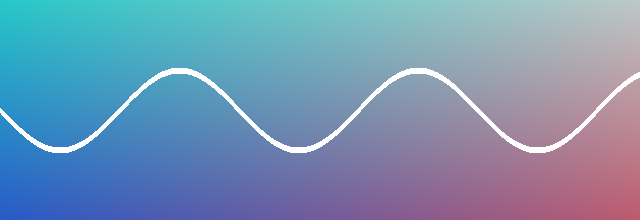

# Writing, and nothing else

Stet shows your *source*, styled just enough to read: **bold**, *italic*,
~~struck~~, `inline code`, and [links](https://example.com) keep their markers,
dimmed so the words come first.

## Lists and tasks

- A plain item with a long line that wraps onto the next display row so you can see how wrapped text hangs together
- [x] A finished task
- [ ] An open one — `gt` toggles it
    1. Nested, numbered
    2. Second

> Quotes are quieter than prose.
> — someone, probably

## Review suggestions

Suggestions live in the text as CriticMarkup, so they survive any tool:
the agent proposed {~~a vague phrase~>a precise one~~}{>>id:s_0123abcd by:Agent<<} here,
{++added a clause, ++}{>>id:s_0123abce by:Calvin<<}and wants {--this filler --}{>>id:s_0123abcf by:Agent<<}gone.

## Linked notes

Notes link to each other: [[Ideas]] finds the note anywhere in this folder,
[[Reading list#Next]] lands on a heading, and [a plain link](notes/Reading%20list.md)
works too. `gf` or Enter follows, `Ctrl-o` comes back.

## Code, tables, math

```rust
/// Fences are colored by language.
fn main() {
    let words = ["fast", "quiet"];
    println!("{} of them: {words:?}", words.len());
}
```

```python
def greet(name: str = "world") -> str:
    return f"hello {name}"  # 200+ languages
```

| Key   | Action            |
|-------|-------------------|
| `gsa` | accept suggestion |
| `gsr` | reject suggestion |

Euler wrote $e^{i\pi} + 1 = 0$, with a footnote[^1].



---

[^1]: Footnotes work too.
